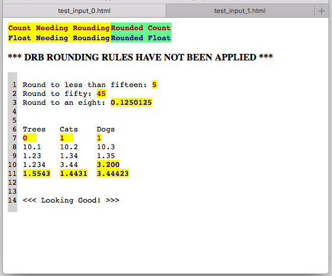
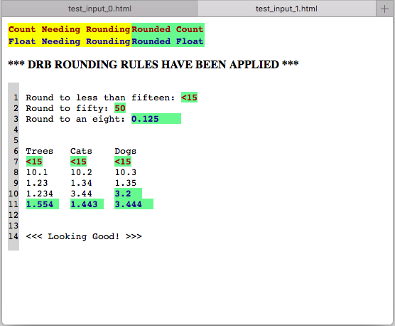

# Using the DRB Rounder The DRB Rounder is a python3 program that
implements the rounding rules for the U.S. Census Bureau's Disclosure
Review Board. These rules provide some protection against disclosure
of information tracable to individuals, but do not provide privacy
protection that is formally provable. The rounding rules are an
interium solution for privacy protection, but the plan is to replace
them with a system that is formally private at some point in the
future.

The DRB Rounder is implemented as a single Python program called `drb_rounder.py`. This program is written in the Python3 programming language. The DRB Rounder currently implements the following features:

* Reads input as a text file and applies the DRB rounding rules to integers are floating point numbers.
* Identifies integers as numbers with no decimal point, and floating point numbers as numbers that have a decimal point. 
* Applies the DRB rules for counts to integers. Specifically:
** If N is less than 15, report N<15
** If N is between 15 and 99, round to the nearest 10
** If N is between 100-999, round to the nearest 50
** If N is between 1000-9999, round to the nearest 100
** If N is between 10000-99999, round to the nearest 500
** If N is between 100000-999999, round to the nearest 1,000
** If N is 1000000 or more, round to four significant digits

* Applies the "round to four decimal places" rule to floating point numbers.
* Implements the IEEE floating point rounding rules with the "round half even" option when rounding. This means that 1000.5 rounds to 1000 while 1001.5 rounds to 1002.

To use the rounder, run the following from the Unix or Windows command line. Note that `python3` must be in your path:

    python3 drb_rounder.py filename.log

Where `filename.log` is the name of the text file containing numbers to be rounded.

This will produce three output files:

  * `filename_rounded.log` --- The file with the rounded data
  * `filename_0.html` --- An HTML file showing the original data, with annotations on the values that require rounding.
  * `filename_1`.html`--- An HTML file showing the rounded data, with annotations to indicate what was rounded.

If you open both of the HTML files in different tabs of a web browser, you can easily toggle between the two views:

  

 